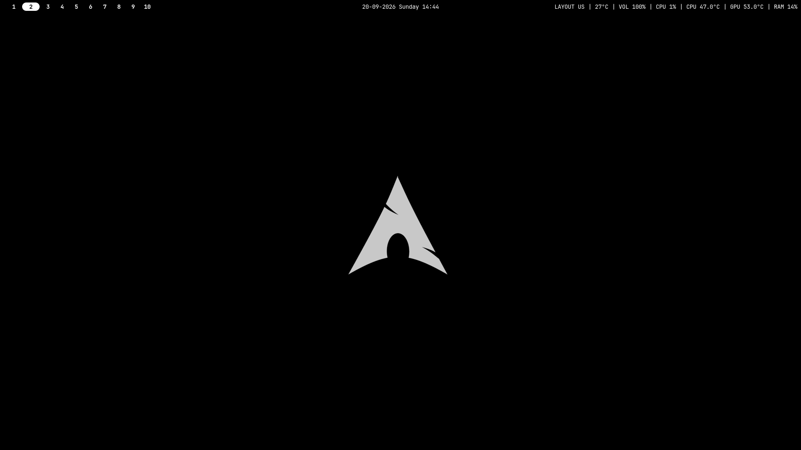
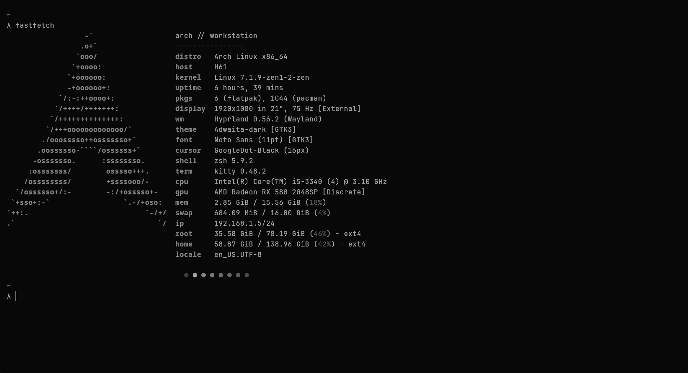
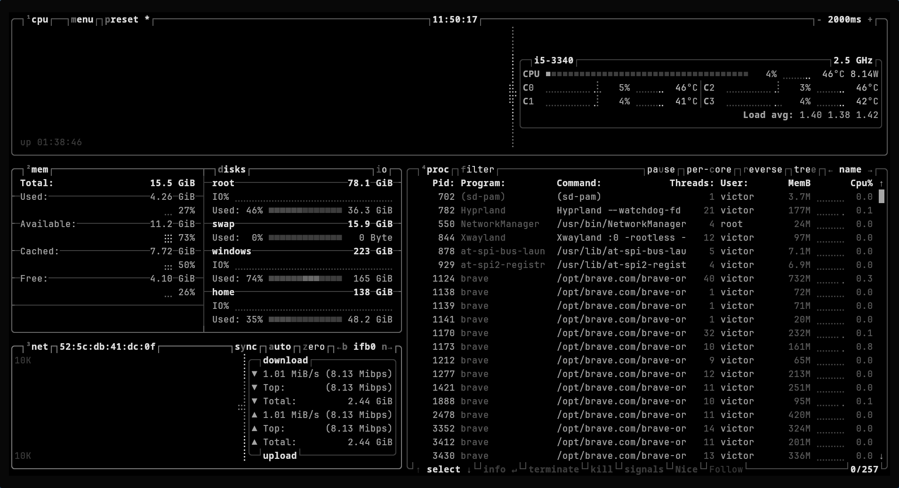

# Dotfiles

Personal Linux desktop configuration for Arch Linux + Hyprland, kept close to the files that actually run the setup. The theme is intentionally minimal: dark surfaces, monochrome accents, compact spacing, and tools that stay out of the way.

## Showcase

| Desktop | Terminal | System monitor |
|---|---|---|
|  |  |  |

## What's here

- **`hypr/`** - Hyprland session (configured in Lua), keybinds, monitor layout, animations, window rules, and startup apps.
- **`waybar/`** - top bar configuration, modules, and color theme.
- **`kitty/`** - terminal font, padding, and color palette.
- **`mako/`** - minimal notification daemon configuration.
- **`rofi/`** - application launcher, styled to match the desktop.
- **`btop/`** and **`htop/`** - system monitor configuration.
- **`MangoHud/`** - in-game performance overlay configuration.
- **`fastfetch/`** - compact system summary shown on new terminal sessions.
- **`starship.toml`** - shell prompt configuration.
- **`gtk-3.0/`** and **`fontconfig/`** - desktop-wide theme and font preferences.
- **`.zshrc`** - Zsh configuration with Oh My Zsh and Starship prompt.

## Desktop Notes

The window manager is Hyprland, configured in Lua, running a single 1080p monitor at 75Hz. Gaps are small, borders are disabled, and animations are fast but restrained (custom bezier curves, short durations, no shadows or blur). Mouse acceleration is disabled system-wide (`force_no_accel = true`) for consistent tracking.

The main binds use `SUPER` with directional focus and movement:

- `SUPER + Return` opens kitty.
- `SUPER + D` opens the launcher (rofi).
- `SUPER + E` opens the file manager (Thunar).
- `SUPER + B` opens the browser.
- `SUPER + W` / `C` / `G` / `P` / `N` / `O` opens Vesktop, VS Code, Steam, Spotify, Stremio, and Obsidian.
- `SUPER + V` opens the window switcher (rofi).
- `SUPER + arrow keys` moves focus between windows.
- `SUPER + SHIFT + arrow keys` moves windows.
- `SUPER + F` toggles floating.
- `SUPER + Q` closes the active window.
- `SUPER + SHIFT + Q` exits Hyprland.
- `SUPER + T` toggles a window group; `SUPER + Tab` / `SUPER + SHIFT + Tab` cycles through it.
- `SUPER + R` reloads the Hyprland config.
- `SUPER + SHIFT + R` refreshes the wallpaper.
- `SUPER + ALT + R` enters a resize submap (arrow keys resize, `Escape`/`Return`/`SUPER + R` exits).
- `SUPER + 1-0` switches workspaces; `SUPER + SHIFT + 1-0` moves the active window to a workspace.
- `SUPER + S` / `SUPER + SHIFT + S` / `SUPER + ALT + S` take region, full, and active-window screenshots (`grim` + `slurp` + `satty`).

On startup, Hyprland launches `waybar`, `hyprpaper`, and `mako`.

## Setup

This repository is meant to live at `~/.config` (plus `.zshrc` in the home directory). It is not a universal installer, and some values are machine-specific, especially the monitor name/mode in `hypr/hyprland.lua`, cursor theme, and any hardware-specific tuning done outside these files.

Core packages used by this setup include:

- Hyprland (with Lua config support)
- Waybar
- kitty
- rofi
- mako
- hyprpaper
- fastfetch
- Starship
- Zsh + Oh My Zsh
- btop / htop
- MangoHud
- grim, slurp, satty (screenshots)
- A Nerd Font (for waybar/kitty/starship glyphs)

After placing the files, review:

- `hypr/hyprland.lua` for the monitor block (`output`, `mode`, `position`), keyboard layout, and any paths referencing `$HOME`.
- `hypr/hyprpaper.conf` for wallpaper paths.
- `waybar/config.jsonc` and `waybar/style.css` for bar modules and theme.
- `kitty/kitty.conf` for font family and size.
- `.zshrc` for Oh My Zsh plugins/theme and any machine-specific aliases.

## Scope

This repo is managed as a bare Git repository tracking $HOME directly, so only files explicitly added with git add are tracked — nothing is captured implicitly. A .gitignore is also kept as a safety net against secrets, caches, and machine-specific tweaks (kernel/sysctl/udev tuning) ever being added by accident.
